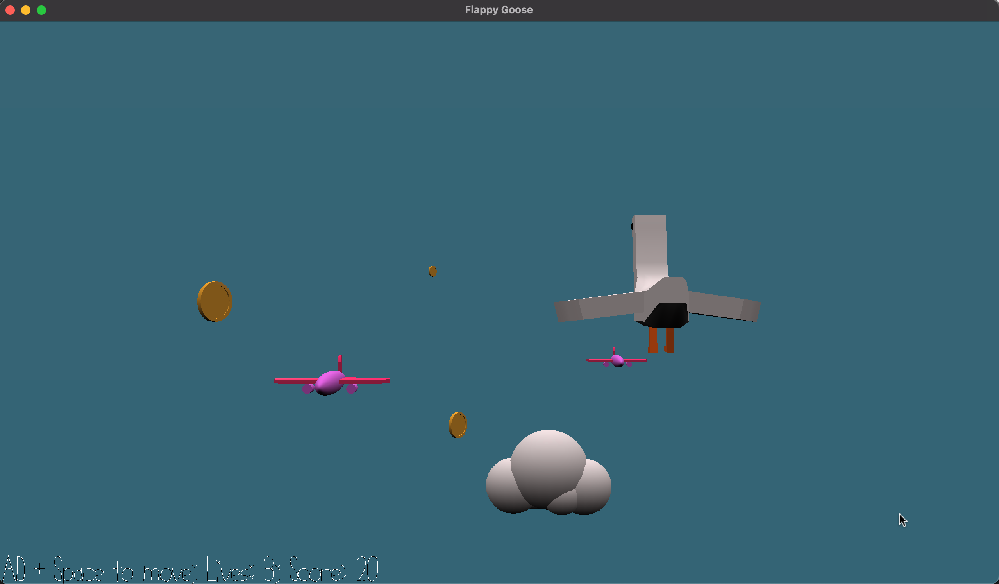

# Flappy Goose

**Author:** Angela Zhang

**Design:** Join Lucy the Loosey Goosey on her journey through the skies! Collect coins, avoid planes, and don't stop flapping

**Screen Shot:**

**How To Play:**

Control Lucy by pressing space to flap (fly) and A/D to move left and right. Collect coins for a higher score and avoid being hit by planes.

**Development Details**
All assets were originally created in Maya, then exported to Blender for duplication and final adjustments. The meshes were vertex painted and are read into the game through the provided Python scripts.

The main animating component is the goose itself - when the goose is flying, its wings will flap. Its legs will also move in a repeating pattern throughout the game.

For collisions, I created empty objects in Blender that were scaled to be approximate boxes for each of the main objects (bird, coin, plane). The code then checks for box collision using these Transforms, their positions and scales.

This game was built with [NEST](NEST.md).
